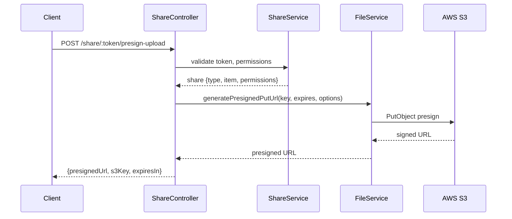
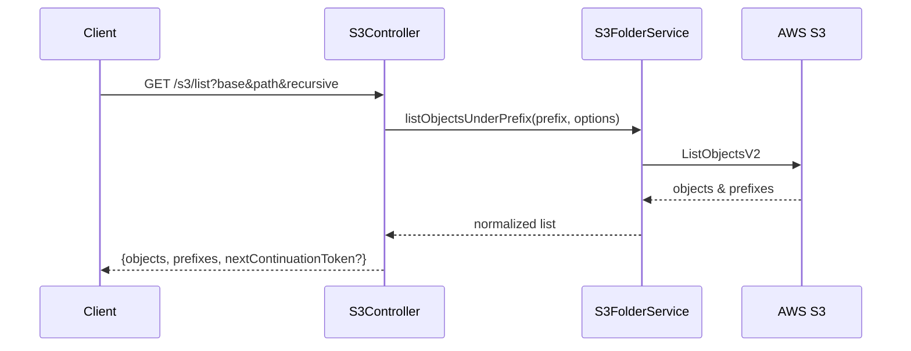

# Architecture

This project follows a clean, layered architecture that separates HTTP concerns (controllers/routes/middleware) from business logic (services) and data access (models). It integrates AWS S3 for object storage and MongoDB for metadata and identities.

## High-Level Components
- `app.ts` – Express app setup (security headers, CORS, rate limiter, logger, JSON parsing, Swagger UI).
- `server.ts` – Bootstraps the app and database connection, handles graceful shutdown and fatal errors.
- `api/v1/` – Versioned API: controllers, routes, and middleware.
- `services/` – Business logic for auth, files, folders, shares, and S3 operations.
- `models/` – Mongoose schemas (User, File, Folder, Share).
- `config/` – Database, rate limiter, Swagger setup.
- `utils/` – Logger, JWT utilities, validation helpers, response formatting.

## Request Lifecycle
1. Client sends HTTP request.
2. `routes` map paths to `controllers`.
3. `middleware` (auth, rate limit, request logging) run before controllers.
4. Controller validates input and calls `services` for business logic.
5. Services interact with `models` (MongoDB) and external APIs (AWS S3).
6. Controller returns a normalized JSON response via `ResponseController`.

## Key Modules and Responsibilities
- `authService` – JWT issuance/verification, user authentication.
- `fileService` – File metadata, S3 uploads/downloads, presigned GET/PUT, user access checks.
- `folderService` – Folder metadata and hierarchy operations.
- `s3FolderService` – S3 prefix listing (objects/prefixes), recursion & pagination.
- `shareService` – Share CRUD, token generation, permission normalization, expiry & recipient gating.

## Data & Storage
- MongoDB stores users, files, folders, and share metadata.
- AWS S3 stores file binary data.
- Presigned URLs (`GET`: download, `PUT`: upload) are generated server-side and returned to clients.

## Sharing & Permissions
- Share permissions: `view`, `download`, `edit`.
- `allowedEmails` restricts access to specified recipients.
- `expiresAt` controls share validity; revoked shares are blocked.
- Uploads via shares require `edit`; PUT presigns optionally enforce server-side encryption (`AWS_SSE`).

## S3 Listing
- `listObjectsUnderPrefix(prefix, options)` enumerates objects and prefixes under user-scoped paths.
- `s3Controller.listS3Objects` exposes `GET /api/v1/s3/list` with `base`, `path`, `recursive`, `maxKeys`, `continuationToken`.

## Error Handling & Logging
- Consistent error responses via `ResponseController`.
- Structured logs via `winston` with contextual metadata.
- Graceful shutdown on `SIGINT`/`SIGTERM`, with handling for unhandled rejections and uncaught exceptions.

## Security Measures
- JWT-based authentication and request rate limiting.
- Presigned URL expirations are constrained; minimal lifetimes are recommended.
- Optional SSE (`AWS_SSE`) for uploads; credentials scoped to required S3 actions.

## Diagrams

### Component Diagram
```mermaid
graph TD
  A[Client] --> B[Routes]
  B --> C[Controllers]
  C --> D[Services]
  D --> E[Models (MongoDB)]
  D --> F[AWS S3]
  C --> G[ResponseController]
```

### Share Upload (Presign PUT) Flow


### S3 Listing Flow


## Testing
- `jest` for unit and integration tests.
- Focused tests around services and permission logic are recommended.

## Extensibility
- Add new API versions under `api/v1` as `v2` without disrupting existing routes.
- Introduce new services with clear interfaces and keep controllers thin.
- Prefer adding integration tests when changing storage or permission flows.